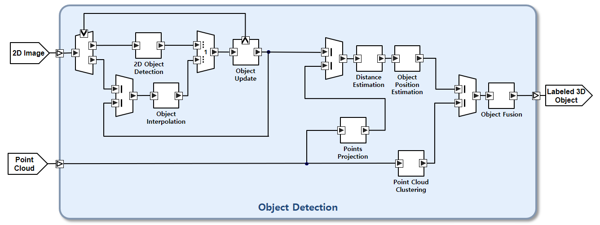

.. Splash documentation master file, created by
   sphinx-quickstart on Thu Oct 25 13:55:39 2018.
   You can adapt this file completely to your liking, but it should at least
   contain the root `toctree` directive.

Welcome to Splash's documentation!
==================================

Splash is a stream processing language for real-time and embedded AI. It represents stream processing algorithms graphically, generates code that can be executed on runtime, and supports the correct implementation of the algorithms.

.. toctree::
   :maxdepth: 1 
   :caption: Language Overview:

   language_overview/basic_concepts
   language_overview/language_constructs
   language_overview/timing_constraint_annotation
   language_overview/exception_handling

.. toctree::
   :maxdepth: 1 
   :caption: Schematic Capture:

   schematic_capture/how_to_install_schematic_capture_tool
   schematic_capture/creating_a_new_project
   schematic_capture/designing_an_application
   schematic_capture/producing_result_in_json_format

.. toctree::
   :maxdepth: 1 
   :caption: Code Generation:

   code_generation/how_to_install_code_generation_tool

.. toctree::
   :maxdepth: 1 
   :caption: Splash Runtime:
