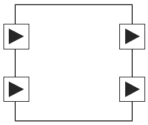
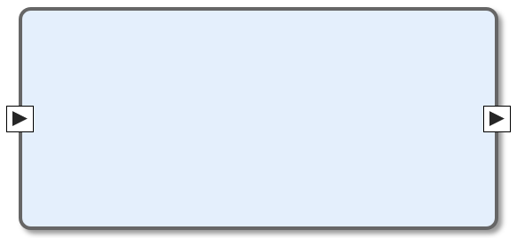
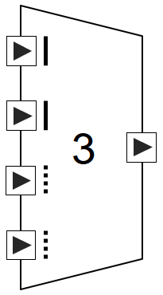
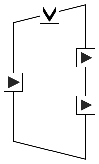

Language Constructs of Splash
=============================

Component
---------

Processing Block
................

The processing block is the smallest execution unit of stream processing. It takes a set of data elements as input, performs an operation defined by the developer, and outputs the results.

Factory
.......

The factory is the largest building block of stream processing and contains a data flow graph that combines Splash language constructs internally. The node of the data flow graph is the component. The edge of the data flow graph is the pipe.

Fusion Operator
...............

The fusion operator is an operator that merges multiple stream data into one stream data.

Selection Operator
..................

The selection operator is an operator that selects the delivery path for an input stream data.

Source
......

Sink
....

Port
----

The port is a part of a component where data can enter or leave.

Pipe
----

The pipe is a delivery path for data and connects two ports.
